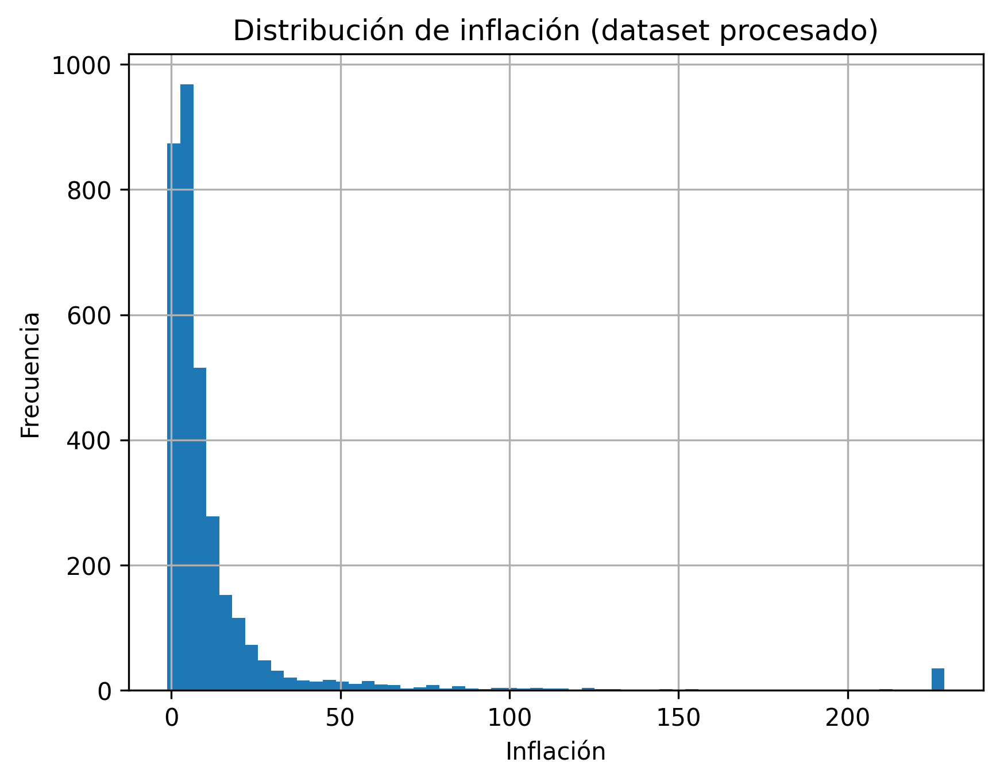
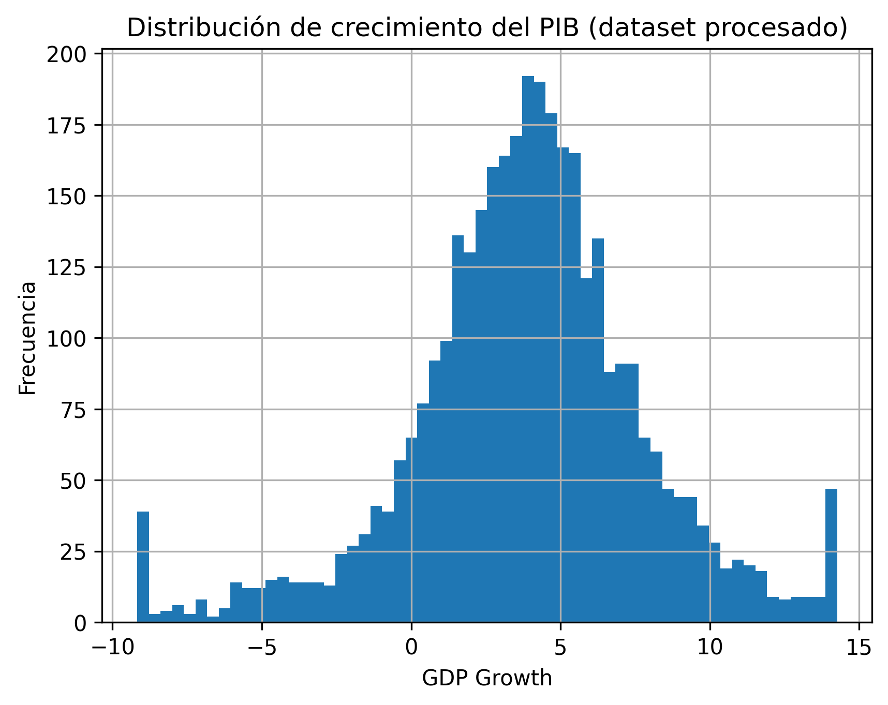
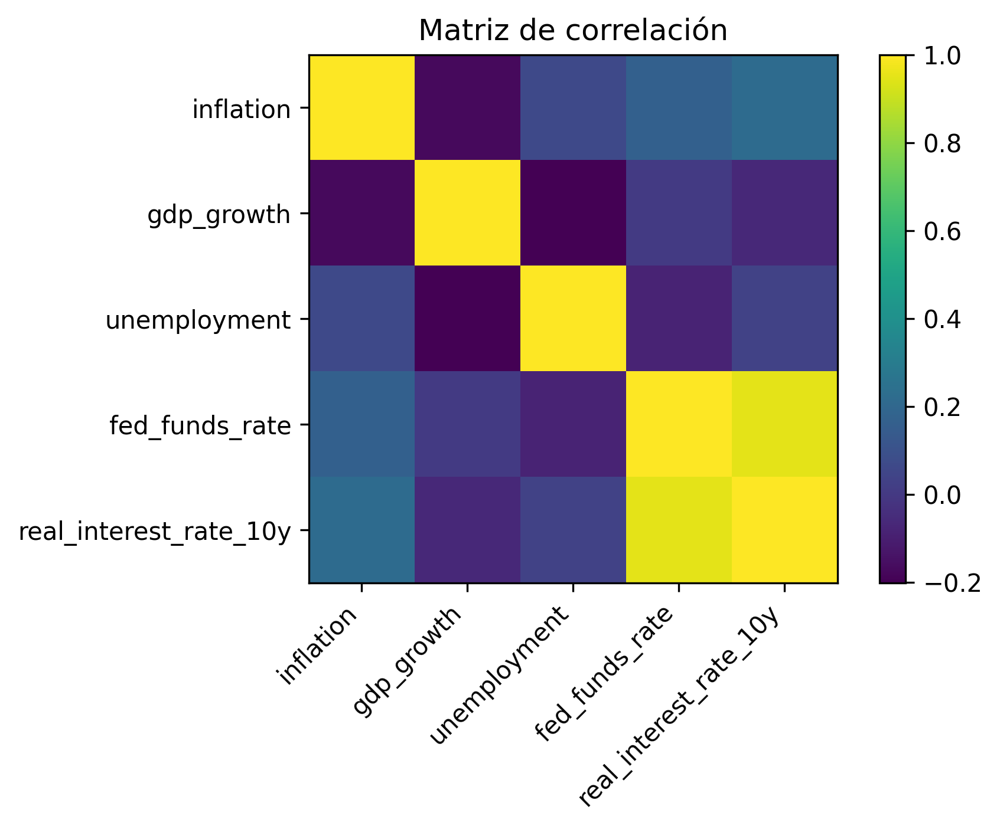

# 📊 Análisis de Crisis Financieras Globales  
### Limpieza, Tratamiento de Outliers y Análisis Exploratorio de Datos

---

## 📌 Contexto del Proyecto

Este proyecto tiene como objetivo analizar un dataset histórico de crisis financieras a nivel global, trabajando bajo un enfoque reproducible y modular en Python.

Más allá de simplemente explorar los datos, el trabajo se centra en:

- Construir un **pipeline de limpieza reproducible**
- Aplicar **tratamiento sistemático de outliers**
- Realizar un **Análisis Exploratorio de Datos (EDA) documentado**
- Garantizar calidad mediante **testing automatizado**
- Utilizar buenas prácticas como **funciones puras, tipado estricto y modularización**

El enfoque es académico y metodológico: cada decisión de procesamiento está justificada.

---

## 🗂 Estructura del Proyecto

Repositorio_APIS/
│
├── data/
│   ├── raw/          # Dataset original
│   └── processed/    # Dataset limpio y tratado
├── notebooks/
│   └── 01_eda.ipynb
├── docs/
│   └── img/          # Gráficos usados en este README
├── src/              # Módulos del proyecto
├── scripts/
│   └── make_dataset.py
├── tests/
└── README.md

---

## ⚙️ Cómo Reproducir el Proyecto

### 1️⃣ Crear entorno virtual

```bash
py -3.11 -m venv .venv
.\.venv\Scripts\Activate.ps1
```

### 2️⃣ Instalar dependencias

```bash
pip install -r requirements.txt
```

### 3️⃣ Generar el dataset procesado

```bash
python -m scripts.make_dataset
```

### 4️⃣ Ejecutar tests

```bash
pytest -q
```

---

# 📊 Análisis Exploratorio de Datos (EDA)

El análisis completo se encuentra en:

notebooks/01_eda.ipynb

A continuación se resumen los hallazgos más relevantes.

---

## 🔎 1. Calidad de los Datos

El dataset contiene:

- **3864 observaciones**
- Información longitudinal por país–año
- Amplia cobertura internacional

Se identificaron variables con valores nulos relevantes, especialmente:

- `unemployment`
- `real_interest_rate_10y`

Esto implica que cualquier modelo futuro deberá considerar estrategias de imputación o trabajar con subconjuntos de variables según disponibilidad.

---

## 📉 2. Tratamiento de Outliers

Se detectaron valores extremos en variables como:

- `inflation`
- `gdp_growth`

En el dataset original, la inflación alcanzaba valores superiores a **11,000%**, reflejando episodios de hiperinflación.

Se aplicó un recorte por cuantiles (1%–99%), reduciendo el máximo procesado a aproximadamente **228%**.

Este procedimiento mejora la estabilidad estadística sin eliminar observaciones.

### Distribución de inflación (procesado)



### Distribución de crecimiento del PIB



---

## ⚠️ 3. Variables de Crisis

Las variables binarias (`crisis_any`, `banking_crisis`, etc.) presentan un fuerte desbalance:

- Predominan los años sin crisis
- Los eventos de crisis son poco frecuentes

Esto es coherente con la naturaleza de los eventos financieros, pero implica que futuros modelos deberán manejar el problema de **class imbalance**.

---

## 📈 4. Relaciones Observadas

Al comparar años con y sin crisis:

- La inflación tiende a ser mayor en años con crisis.
- El crecimiento del PIB tiende a ser menor o más volátil.

Aunque el análisis es descriptivo, los resultados son consistentes con teoría macroeconómica.

### Matriz de correlación (variables numéricas)



No se observan problemas severos de multicolinealidad, aunque algunas variables muestran correlaciones moderadas.

---

## 🧪 Calidad del Código

El proyecto implementa buenas prácticas:

- Funciones puras
- Modularización clara (`src/`)
- Decoradores personalizados
- Tipado estático estricto
- Testing automatizado con pytest
- Pipeline reproducible

---

## 🎯 Conclusión General

El dataset presenta una estructura adecuada para análisis tipo panel y modelado predictivo.

El tratamiento de outliers mejora la estabilidad estadística y la interpretación de resultados.

Las principales limitaciones identificadas son:

- Presencia de valores faltantes en variables macroeconómicas
- Desbalance en variables de crisis

El pipeline desarrollado garantiza trazabilidad metodológica y reproducibilidad del análisis.